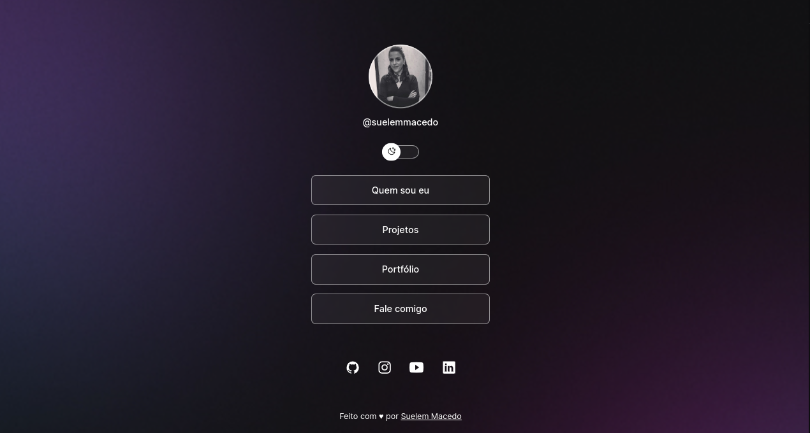

<h1 align="center"> DevLinks </h1>

  <a href="#-tecnologias">Tecnologias</a>&nbsp;&nbsp;&nbsp;|&nbsp;&nbsp;&nbsp;
  <a href="#-projeto">Projeto</a>&nbsp;&nbsp;&nbsp;|&nbsp;&nbsp;&nbsp;
  <a href="#-layout">Layout</a>&nbsp;&nbsp;&nbsp;|&nbsp;&nbsp;&nbsp;
  <a href="#memo-licença">Licença</a>

  

 

## 🚀 Tecnologias

Esse [projeto](https://suelemmacedo.github.io/DevLinks/) foi desenvolvido com as seguintes tecnologias:

- HTML e CSS
- JavaScript
- Git e Github
- Figma

## 💻 [Projeto](https://suelemmacedo.github.io/DevLinks/)

O DevLinks é um agregador de links para usar como cartão de visitas online.
Acesse o projeto nesse [LINK](https://suelemmacedo.github.io/DevLinks/).

## 🔖 Layout

Você pode visualizar o layout do projeto através [desse link](https://www.figma.com/community/file/1187422022288947321). É necessário ter conta no [Figma](https://figma.com) para acessá-lo.

## :memo: Licença

Esse projeto está sob a licença MIT.

---

Feito com ♥ by Suelem Macedo.
